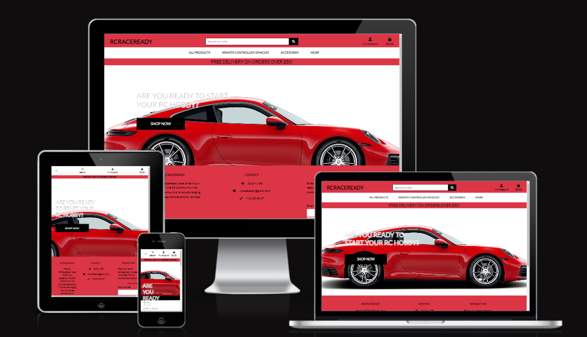
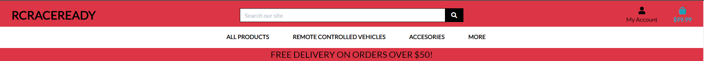
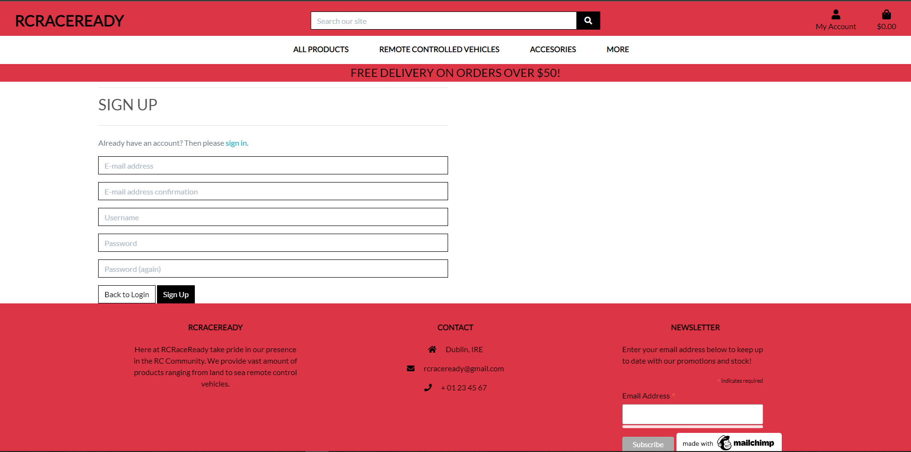
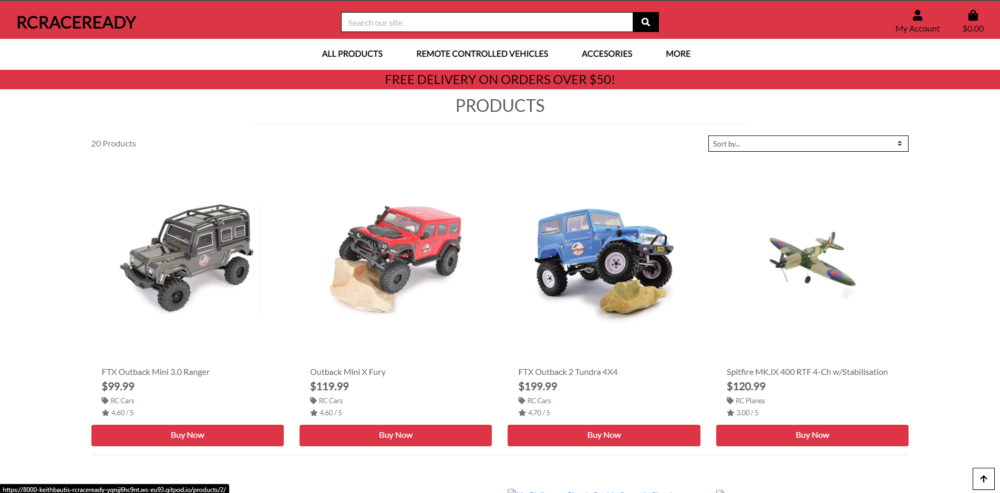
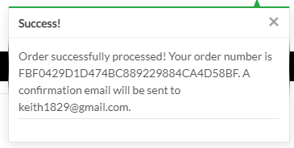
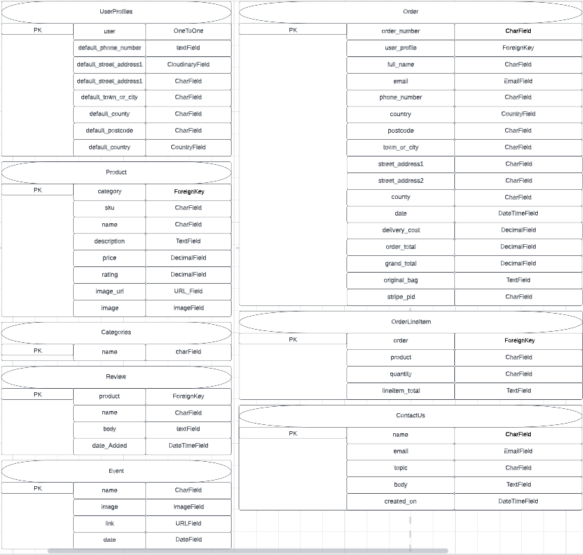
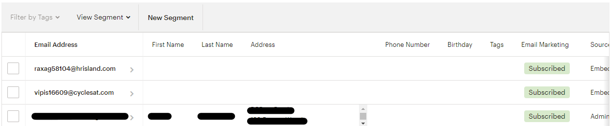
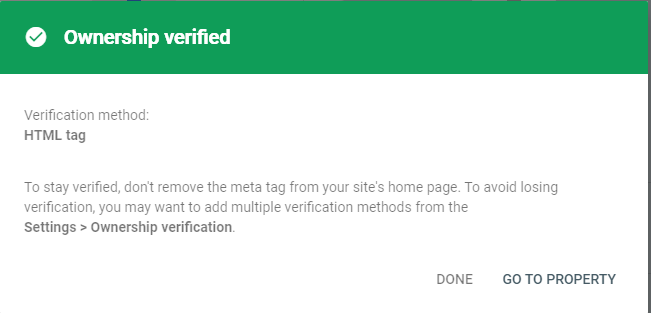

# RCRaceReady - Introduction
Project Milestone 5 for the Code Institute Development Program. <br><br>
RCRaceReady is an ecommerce remote-controlled (RC) toy store offers an exciting range of cars, helicopters, and planes that are perfect for hobbyists and enthusiasts of all ages. The site is dedicated to bringing customers the best selection of RC toys at affordable prices, and they strive to ensure that their customers have a seamless shopping experience.
[Live Project Here](https://rcraceready.herokuapp.com/)



[Live Project Here](https://rcraceready.herokuapp.com/)


README Table Content
- [RCRaceReady](#rcraceready---introduction)
    - [UX](#user-experience)
      - [User Stories](#user-stories)
      - [Agile Methodology](#agile-methodology)
      - [The Scope](#the-scope)
    - [Features](#features)
        - [Home Page](#home-page)
        - [Navbar](#navbar)
        - [Login Page](#login-page)
        - [Profile Information](#profile-information)
        - [Registration Page](#registration-page)
        - [Products Page](#products-page)
        - [Sorting](#sorting)
        - [Product Categories Mini](#product-categories-mini)
        - [Shopping Cart](#shopping-cart)
        - [Checkout Page](#checkout-page)
        - [Contact Us](#contact-us)
        - [Product Review](#product-review)
        - [Events](#events)
    - [Design](#design)
        - [Colours](#colours)
        - [Typography](#typography)
        - [Imagery](#imagery)
        - [Wireframes](#wireframes)
        - [Database Diagram](#database-diagram)
        - [Business Model](#business-model)
    - [Testing](#testing)
    - [Marketing and Social Media](#marketing-and-social-media)
        - [Market Research](#market-research)
        - [Facebook Page](#facebook-page)
        - [Mailchimp Subscription Service](#mailchimp-subscription-service)
        - [Privacy Policy](#privacy-policy)
    - [Search Engine Optimization](#search-engine-optimization)
        - [Sitemap XML](#sitemap-xml)
        - [Robot TXT](#robot-txt)
        - [Sitemap Google Vegistration](#sitemap-google-verification)
    - [AWS S3 Bucket](#aws-s3-bucket)
    - [IAM Set Up](#iam-set-up)
    - [Connecting AWS to the Project](#connecting-aws-to-the-project)
  - [Stripe Payments](#stripe-payments)
    - [Payments](#payments)
    - [Webhooks](#webhooks)
  - [Technologies Used](#technologies-used)
    - [Languages Used](#languages-used)
    - [Django Packages](#django-packages)
    - [Frameworks - Libraries - Programs Used](#frameworks---libraries---programs-used)
  - [Creating the Django app](#creating-the-django-app)
  - [Deployment of This Project](#deployment-of-this-project)
  - [Forking This Project](#forking-this-project)
  - [Credits](#credits)
    - [Content](#content)
    - [Information Sources / Resources](#information-sources--resources)
  - [Special Thanks](#special-thanks)

# User Experience

## User Stories
As a website user, I want to:

1. Be able to navigate around the site easily and view the desired content.
2. Be able to view a list of products and choose accordingly.
3. Be able to search for a specific product.
4. Be able to click on a product to read and view its details.
5. Be able to register for an account to avail of the services offered to members.
6. Be able to view product comments to read other users' opinions.
7. Be able to buy a product by using the website checkout system.
8. Be able to see any up coming events related to remote controlled vehicles.
9. Be able to contact the site owner in case I have any queries.


As a logged-in website user, I want to:

1. Purchase a product using my own personal profile and save my details for future purchases.
2. Save my data under a personal profile.
3. Manage my profile and change details in case my address has changed.
4. Logout of the site.
5. Leave a review on a product.

As a website Superuser, I want to:

1. Create and Publish a new product whether it be from the site itself or from my admin page.
2. Create a draft of a new product so that it can be finalized later.
3. Create new users, products, categories, events.
4. Delete, users, products, reviews, categories as well as events that may have already happened.
5. Review any queries that have come through the contact us form.

## Agile Methodology 
All functionality and development of this project were managed using GitHub and can be found [here](https://github.com/KeithBautista/RCRaceReady/issues)

## The Scope

Objectives:

- Provide users with an enjoyable website experience that allows them to purchase rc products with ease.
- Provide a visually pleasing website that easy to navigate.
- Provide a website that has a clear purpose.
- Provide tools to the user in order to have ease of mind when purchasing ie. form to contact
- Provide an easy and secure checkout process that uses visuals to enable the customer to have that confidence that they have successfully purchased a product.

# Features

## Home Page 

- The landing page is the first thing that the user sees, a pop of red with the car being the background, a slogan which mentions new collections are in store as well as a button below to route to said collections.

## Navbar

- The Navbar is responsive and can be both viewed in desktop and mobile view. Full screen will show case the whole width of the navbar whilst when on mobile a hamburger menu appears along with the options to pick from below it.


## Login Page

- The login page is your standard one whereby you are prompted to place in your username and password. Once account details are filled in, two buttons below allow you to go back to the homepage whilst the other enables you to login into your account.


## Profile Information

- Once logged in, you can head to the top right and click on my profile. This allows you to change any details you have saved on your account. Along with this, if you have purchased any products previously. You can select the order number and see a summary.

## Registration Page

- Similar to the login page, the registration page is simple and standard, one where details such as your email address, username, and password 2x are prompted. Again similar to the Login page, we have two buttons below which enables you to either go to login if an account is already present while the other enables you to sign up once all the details have been filled out.

## Products Page

- The product page is the bread and butter of the site. It showcases different variety of remote controlled vehicles ranging from land to sea. Along with this you are able to see the price, category as well as the rating given to the product.

## Sorting

- Within the Products page is a sort by filter which allows to do just that. Whether you are searching for the highest priced vehicle we have or the lowest, this filter will enable you to do so. Along with this you can sort by name a-z or z-a, rating as well as category.

## Product Categories Mini

- When in the all products tab, along the below of the nav bar are mini categories that you can select to easily transfer between types of vehicles you want to perhaps purchase.

## Shopping Cart

- Once you have decided to purchase a product, you can add to your cart and see a notification on the top right hand side of the page luring you to a quick checkout.


## Checkout Page

- Once you have added all the products you wish to purchase, you can head to the checkout page which showcases all the products that have been added and their total price.
- If you are successfull in purchasing a product you will receive a notification that it has been successful, you will then be routed into a whole page summary of your order along with where it is headed!




## Contact Us

- The contact us page allows users to place in their details which enables us as a business owner to respond to their requests.

## Product Review

- The product review allows users to be able to leave a review on the product.

## Events

- The events page allows users to be able to access the page and find events that are RC Related around the world.

# Design

## Colours
<br>

The color scheme was kept simple and default, #FFFFFF #000000 were used to mimick a race flag whilst #DB3545 on the other hand for reaching the red line on a tachometer in the car. While these are the major colors that take up the site, there are minimal colors using the bootstrap package that allows a user to be aware of changes made in the site using toasts. Along with this, other minimal colors were used for CTA luring the user to click.

## Typography

- The standard Lato font family was used as the main font for the whole site.

##  Imagery

- The images that were used in the site were taken from [radiocontrolledshop](https://www.radiocontrolledshop.ie/), they were then saved within the media folder in the project to which then moved to AWS's S3 Bucket to be stored along with static files.

##  Wireframes
- Wireframes for this project are located [here](WIREFRAMES.md)

##  Database Diagram
<br>

##  Business Model
[Keywords Challenge](https://docs.google.com/spreadsheets/d/18EVzSxrN41_4AwSnjIZLjwLFof2XB2aX0Zz91h55yJc/edit?usp=sharing)<br>
[Content Challenge](https://docs.google.com/document/d/1xo47v1a4GzaEzq5p_2_6vz44KEzUZcMLUMSJ5PmdybM/edit?usp=sharing)<br>
[Marketing Challenge](https://docs.google.com/document/d/1riemnhv4mQ4VZ4yw7ZzYdkPSSJdo7C5HcqgRGXJClVQ/edit?usp=sharing)<br>


## Testing
To find the manual testing results please click [here](TEST_CASE.md)<br>
To find the validation, lighthouse results please click [here](TESTING.md)<br>

# Marketing and Social Media

## Market Research
Market research was conducted using statista to determine which social media site was most suitable to promote the RCRaceReady site. For social media marketing, Facebook still is the best and easiest option to promote products and brands to customers. It is one of the most used social media platforms with the age bracket 18-24 accounting for nearly 22% of the users using facebook. This being our ideal target audience for RCRaceReady, it was a done deal to utilize Facebook as our first social media platform to promote our products.

Along with this I have found that at the moment there are currently 2 Billion 37 Million active users on Facebook which is on the trend to keep increasing.
<br>
Distribution of Daily Active Facebook Users worldwide as of 1st quarter of 2023 can be found [here](https://www.statista.com/statistics/346167/facebook-global-dau/)
<br>
Distribution of Facebook users worldwide as of January 2023, by age and gender [here](https://www.statista.com/statistics/376128/facebook-global-user-age-distribution/)

## Facebook Page


Live Facebook Page can be found [here](https://www.facebook.com/people/RCRaceReady/100091656601934/)

## Mailchimp Subscription Service
Embedded within the RCRaceReady Site, there is a newsletter subscription service at the footer. This enables users to be able to subscribe to the RCRaceReady newsletter and potentially receive pre go live news as well as offers. In exchange for this we are able to actively send newsletters to customers and inform them of any offers. This allows customers to be reminded that our site exists as well as an option for any of their needs.


## Privacy Policy
- As we collect user data it is vital to let our users know how we will collect, use, and protect their data. In turn which is why I have included a privacy policy under "More" in the navbar.
<br>
<br>
[Privacy Policy Generator](https://www.privacypolicygenerator.info/) was used to create the RCRaceReady Privacy Policy to ensure that the website is compliant with the European Privacy Policy Rules
<br>
<br>
Please find the RCRaceReady Privacy Policy [here](https://www.privacypolicygenerator.info/live.php?token=j1hkjxFPwjJ8WtGQ5NQrMHhvbnBEhu2N) 


# Search Engine Optimization
The site was optimized using a selection of words related to Remote Controlled or RC. The entire table showcases phrases that may be searched when looking for a site that sells RC Vehicles. Topics that meet the criteria such as being too long or too vague have been automatically removed. Topics were also tested out within multiple search engines to see the results and the relevent returned search suggestions from said search engine were place within this table.


## Sitemap Xml
To ensure that search engines can easily navigate through the site and understand its structure, a sitemap file containing a list of important URLs was added. The following steps were followed using XML-sitemaps.com to create the sitemap file:

1. The URL of the deployed site was pasted into XML-sitemaps.
2. The XML sitemap file was downloaded.
3. The downloaded file was added into the root folder of the project and named as sitemap.xml.

## Robot Txt
To improve the SEO rating of the website and enhance its quality, a robots.txt file was created. This file specifies the areas of the website that search engines should not crawl.


## Sitemap Google Verification
To ensure that the Google Engine will search the websites' sitemap, I have registered RCRaceReady url on the Google Search Console. In order to do this via HTML tag, Google generated a tag that I have copied and pasted base html page within the header tag. Once completed, I then pushed the changes live and validated within Google Seach Console.<br>


## AWS S3 Bucket 

The deployed website utilizes AWS S3 Buckets to store static and media files. Here's a step-by-step guide to setting up an AWS S3 Bucket:

<ol>
  <li>Create an AWS account by following this link.</li>
  <li>Log in to your account and type "S3" in the search bar.</li>
  <li>Click on "Create Bucket" on the S3 page.</li>
  <li>Name the bucket and select the region closest to you.</li>
  <li>Under "Object Ownership," select "ACLs enabled."</li>
  <li>Uncheck "Block Public Access" and acknowledge that the bucket will be made public, then click "Create Bucket."</li>
  <li>In the created bucket, click on the "Properties" tab. Under "Static Website Hosting," click "Edit," and enable static website hosting. Copy the default values for the index and error documents and click "Save Changes."</li>
  <li>Go to the "Permissions" tab, click "Edit" below "Cross-origin Resource Sharing (CORS)," and paste in the following code:</li>


  ```
    [
        {
            "AllowedHeaders": [
            "Authorization"
            ],
            "AllowedMethods": [
            "GET"
            ],
            "AllowedOrigins": [
            "*"
            ],
            "ExposeHeaders": []
        }
    ]
  ```


  <li>Go to the "Bucket Policy" section and click "Edit."</li>
  <li>Click "Policy Generator."</li>
  <li>In the "Select Type of Policy" dropdown, select "S3 Bucket Policy."</li>
  <li>In the "Principle" field, allow all principals by typing "*."</li>
  <li>In the "Actions" dropdown menu, select "Get Object."</li>
  <li>In the previous tab, copy the "Bucket ARN number."</li>
  <li>Paste the ARN number into the "Amazon Resource Name (ARN)" field in the policy generator.</li>
  <li>Click "Add statement > Generate Policy."</li>
  <li>Copy the generated policy and paste it into the "Bucket Policy Editor."</li>
  <li>Before saving, add "/*" at the end of your "Resource Key" to allow access to all resources within the bucket.</li>
  <li>Once saved, go to the "Access Control List (ACL)" and click "Edit."</li>
  <li>Next to "Everyone (public access)," check the "list" checkbox.</li>
  <li>Save your changes.</li>
</ol>

## IAM Set Up

<ol>
  <li>Search for IAM within the AWS navigation bar and select it.</li>
  <li>Click "User Groups" that can be seen in the side bar and then click "Create group" and name the group 'manage-your-project-name'.</li>
  <li>Click "Policies" and then "Create policy".</li>
  <li>Navigate to the JSON tab and click "Import Managed Policy", within here search "S3" and select "AmazonS3FullAccess" followed by "Import".</li>
  <li>Navigate back to the recently created S3 bucket and copy your "ARN Number". Go back to "This Policy" and update the "Resource Key" to include your ARN Number, and another line with your ARN followed by a "/*".</li>

- See below:

```
{
    "Version": "2012-10-17",
    "Statement": [
        {
            "Effect": "Allow",
            "Action": [
                "s3:*",
                "s3-object-lambda:*"
            ],
            "Resource": [
                "YOUR-ARN-NUMBER-HERE",
                "YOUR-ARN-NNUMBER-HERE/*"
            ]
        }
    ]
}

```

<li>Ensure the policy has been given a name and a short description, then click "Create Policy".</li>
<li>Click "User groups", and then the group you created earlier. Under permissions click "Add Permission" and from the dropdown click "Attach Policies".</li>
<li>Select "Users" from the sidebar and click "Add User".</li>
<li>Provide a username and check "Programmatic Access", then click 'Next: Permissions'.</li>
<li>Ensure your policy is selected and navigate through until you click "Add User".</li>
<li>Download the "CSV file", which contains the user's access key and secret access key.</li>
</ol>

## Connecting AWS to the Project

<ol>
<li>In your terminal install the following packages by typing:</li>

```
  pip3 install boto3
  pip3 install django-storages 
```  
<li>Freeze the requirements in the requirements.txt file by:</li>

```
pip3 freeze > requirements.txt
```

<li>Add "storages" to your installed apps within your settings.py file.</li>
<li>At the bottom of the settings.py file add the following code:</li>

```
if 'USE_AWS' in os.environ:
    AWS_STORAGE_BUCKET_NAME = 'insert-bucket-name-here'
    AWS_S3_REGION_NAME = 'insert-your-region-here'
    AWS_ACCESS_KEY_ID = os.environ.get('AWS_ACCESS_KEY_ID')
    AWS_SECRET_ACCESS_KEY = os.environ.get('AWS_SECRET_ACCESS_KEY')
```

<li>Within Heroku, add the keys "AWS_ACCESS_KEY_ID" and "AWS_SECRET_ACCESS_KEY", which can be found in your CSV file.</li>
<li>Add the key "USE_AWS" to Heroku and set its value to True.</li>
<li>Remove the "DISABLE_COLLECTSTATIC" variable from Heroku.</li>
<li>Inside the code you just wrote in your settings.py file, add:</li>

```
  AWS_S3_CUSTOM_DOMAIN = f"{AWS_STORAGE_BUCKET_NAME}.s3.amazonaws.com"
```

<li>Inside the settings.py file inside the bucket config if statement add the following pieces:</li>

```
STATICFILES_STORAGE = 'custom_storages.StaticStorage'
STATICFILES_LOCATION = 'static'
DEFAULT_FILE_STORAGE = 'custom_storages.MediaStorage'
MEDIAFILES_LOCATION = 'media'

STATIC_URL = f'https://{AWS_S3_CUSTOM_DOMAIN}/{STATICFILES_LOCATION}/'
MEDIA_URL = f'https://{AWS_S3_CUSTOM_DOMAIN}/{MEDIAFILES_LOCATION}/'

AWS_S3_OBJECT_PARAMETERS = {
    'Expires': 'Thu, 31 Dec 2099 20:00:00 GMT',
    'CacheControl': 'max-age=94608000',
}
```

<li>In the root directory of your project, create a file called "custom_storages.py".</li>
<li>At the top of this file, import the following, and add the classes below:</li>

```
  from django.conf import settings
  from storages.backends.s3boto3 import S3Boto3Storage

  class StaticStorage(S3Boto3Storage):
    location = settings.STATICFILES_LOCATION

  class MediaStorage(S3Boto3Storage):
    location = settings.MEDIAFILES_LOCATION
```

<li>Navigate back to your AWS S3 Bucket.</li>
<li>Click on "Create Folder" and name this folder "media".</li>
<li>Within the "media" folder, click "Upload > Add Files" and select the images for your site.</li>
<li>Under "Permissions", select the option "Grant public-read access", and click "Upload".</li>
</ol>

## Stripe Payments

The Stripe payments system is set up as the online payment processing and credit card processing platform for the purchases.
To get started, you will need a Stripe account, which you can sign up for [here](https://stripe.com/en-ie)

### Payments

- To set up stripe payments you can follow their guid [here](https://stripe.com/docs/payments/accept-a-payment#web-collect-card-details)

### Webhooks

<ol>
<li>To set up a webhook, sign into your Stripe account and click "Developers" located in the top right of the navbar.</li>
<li>Then in the side-nav under the "Developers" title, click on "Webhooks", then "Add endpoint".</li>
<li>On the next page, you will need to input the link to your Heroku app followed by "/checkout/wh/". It should look something like this:</li>

```
    https://your-app-name.herokuapp.com/checkout/wh/
```

<li>Click "+ Select events" and select all events by checking the checkbox at the top.</li>
<li>Click "Add events" at the bottom to save your event selections.</li>
<li>Finish the form by clicking "Add endpoint".</li>
<li>Your webhook is now created and a secret key will be generated. You will need this key to add to your Heroku config vars.</li>
<li>Go to your Heroku app and navigate to the "config vars" section under settings.</li>
<li>In the "config vars" section, add the secret key that you generated for your webhook, as well as your Publishable key and secret key from the API keys section in Stripe.</li>
<li>Add these values under their respective keys:</li>

```
    STRIPE_PUBLIC_KEY = 'insert your stripe publishable key'
    STRIPE_SECRET_KEY = 'insert your secret key'
    STRIPE_WH_SECRET = 'insert your webhooks secret key'

```

<li>Once added, back in your settings.py file in django, insert the following near the bottom of the file:</li>

```
    STRIPE_PUBLIC_KEY = os.getenv('STRIPE_PUBLIC_KEY', '')
    STRIPE_SECRET_KEY = os.getenv('STRIPE_SECRET_KEY', '')
    STRIPE_WH_SECRET = os.getenv('STRIPE_WH_SECRET', '')
```
<br>

## Technologies Used

## Languages Used
- [HTML 5](https://en.wikipedia.org/wiki/HTML/)
- [CSS 3](https://en.wikipedia.org/wiki/CSS)
- [JavaScript](https://www.javascript.com/)
- [Django](https://www.python.org/)
- [Django GitHub](https://github.com/django/django)
- [Python](https://www.djangoproject.com/)<br>

## Django Packages

- [Gunicorn](https://gunicorn.org/) as the server for Heroku
- [Dj_database_url](https://pypi.org/project/dj-database-url/) to parse the database URL from the environment variables in Heroku
- [Psycopg2](https://pypi.org/project/psycopg2/) as an adaptor for Python and PostgreSQL databases
- [Allauth](https://django-allauth.readthedocs.io/en/latest/installation.html) for authentication, registration and account management
- [Stripe](https://pypi.org/project/stripe/) for processing all online and credit card purchases on the website
- [Crispy Forms](https://django-crispy-forms.readthedocs.io/en/latest/) to style the forms
- [Pillow](https://pypi.org/project/Pillow/) to process and save all the images downloaded through the database

## Frameworks - Libraries - Programs Used

- [Bootstrap](https://getbootstrap.com/)
- Was used to style the website, add responsiveness and interactivity
- [Jquery](https://jquery.com/)
- All the scripts were written using jquery library
- [Git](https://git-scm.com/)
- Git was used for version control by utilizing the Gitpod terminal to commit to Git and push to GitHub
- [GitHub](https://github.com/)
- GitHub is used to store the project's code after being pushed from Git
- [Heroku](https://id.heroku.com)
- Heroku was used to deploy the live project
- [W3C - HTML](https://validator.w3.org/)
- W3C- HTML was used to validate all the HTML code
- [W3C - CSS](https://jigsaw.w3.org/css-validator/)
- W3C - CSS was used to validate the CSS code
- [PostgreSQL](https://www.elephantsql.com/)
- Elephantsql Database used through Heroku.
- [VSCode](https://code.visualstudio.com/)
- VSCode was used to create and edit the website
- [Fontawesome](https://fontawesome.com/)
- Was used to add icons to the website
- [Google Chrome Dev Tools](https://developer.chrome.com/docs/devtools/)
- To check App responsiveness and debugging
- [Google Fonts](https://fonts.google.com/)
- To add the 2 fonts that were used throughout the project
- [AWS](https://aws.amazon.com/)
- was used to host the static files and media<br>

## Creating the Django app

1. Go to the Code Institute Gitpod Full Template [Template](https://github.com/Code-Institute-Org/gitpod-full-template)
2. Click on Use This Template
3. Once the template is available in your repository click on Gitpod
4. When the image for the template and the Gitpod are ready open a new terminal to start a new Django App
5. Install Django and gunicorn: pip3 install django gunicorn
6. Install supporting database libraries dj_database_url and psycopg2 library: pip3 install dj_database_url psycopg2
7. Create file for requirements: in the terminal window type pip freeze --local > requirements.txt
8. Create project: in the terminal window type django-admin startproject your_project_name
9. Create app: in the terminal window type python3 manage.py startapp your_app_name
10. Add app to the list of installed apps in settings.py file: you_app_name
11. Migrate changes: in the terminal window type python3 manage.py migrate
12. Run the server to test if the app is installed, in the terminal "The install worked successfully! Congratulations!"

## Deployment of This Project

- This site was deployed by completing the following steps:
<br>
<ol>
<li>Log in to Heroku or create a new account.</li>
<li>Click the "New" button in the top right corner of the main page and select "Create New App" from the drop-down menu.</li>
<li>Enter a unique app name.</li>
<li>Select your region.</li>
<li>Click the "Create App" button.</li>
<li>Click on "Resources" and select "Heroku Postgres database".</li>
<li>Click "Reveal Config Vars" and add the following new records:
<br>
<ul>
    <li>SECRET_KEY</li>
    <li>AWS_ACCESS_KEY_ID</li>
    <li>AWS_SECRET_ACCESS_KEY</li>
    <li>EMAIL_HOST_PASS</li>
    <li>EMAIL_HOST_USER</li>
    <li>STRIPE_PUBLIC_KEY</li>
    <li>STRIPE_SECRET_KEY</li>
    <li>STRIPE_WH_SECRET</li>
    <li>DISABLE_COLLECTSTATIC=1</li>
</ul>
<br>
</li>
<li>Go to the project's "Deploy" tab and click on the "Settings" tab. Scroll down to "Config Vars".</li>
<li>Scroll down to the "Buildpack" section, click "Add Buildpack", select "Python", and click "Save Changes".</li>
<li>Go to the top of the page and select the "Deploy" tab.</li>
<li>Select "GitHub" as the deployment method.</li>
<li>Confirm that you want to connect to GitHub.</li>
<li>Search for the repository name and click the "Connect" button.</li>
<li>Scroll to the bottom of the deploy page and select the preferred deployment type.</li>
<li>Click "Enable Automatic Deploys" for automatic deployment when you push updates to GitHub.</li>
</ol>
<br>

## Forking This Project

- In order to fork this project:
<br>
<ol>
<li>Open [GitHub](https://github.com/KeithBautista/RCRaceReady)</li>
<li>2. Find the "Fork" button at the top right of the page</li>
<li>Once you click the button the fork will be in your repository</li>
</ol>
<br>

## Credits

## Content

- All the products, their images and descriptions were taken from [radiocontrolledshop](https://www.radiocontrolledshop.ie/)

## Information Sources / Resources

- [W3Schools - Python](https://www.w3schools.com/python/)
- [Stack Overflow](https://stackoverflow.com/)
- [Code Institute](https://codeinstitute.net/ie/)

## Special Thanks
- Special thanks goes to Oisin in Tutor Assistance as well as the great videos created for Boutique Ado which helped immensely when creating this project