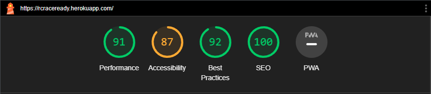

# Testing
Back to the [README](README.md)

* Continuous testing has been conducted throughout the project's development. Each view was regularly tested, and debugging occurred at any point where the outcome did not meet expectations.

## Python Validation - PEP8
* To ensure there were no syntax errors in the project, Python testing was performed using PEP8 Online. All Python files were entered into the online checker, and no errors were found in any of the custom codes.

#### RCRaceReady 
* [asgi.py](assets/readme/testing/pythonValidation/asgiRCRaceReady.png)
* [wsgi.py](assets/readme/testing/pythonValidation/wsgiRCRaceReady.png)
* [urls.py](assets/readme/testing/pythonValidation/urlsRCRaceReady.png)
* [views.py](assets/readme/testing/pythonValidation/viewsRCRaceReady.png)

#### RCRaceReady - Bag
* [contexts.py](assets/readme/testing/pythonValidation/contextsBag.png)
* [urls.py](assets/readme/testing/pythonValidation/urlsBag.png)

#### RCRaceReady - Checkout
* [admin.py](assets/readme/testing/pythonValidation/adminCheckout.png)
* [apps.py](assets/readme/testing/pythonValidation/appsCheckout.png)
* [forms.py](assets/readme/testing/pythonValidation/formsCheckout.png)
* [models.py](assets/readme/testing/pythonValidation/modelsCheckout.png)
* [signals.py](assets/readme/testing/pythonValidation/signalsCheckout.png)
* [urls.py](assets/readme/testing/pythonValidation/urlsCheckout.png)
* [views.py](assets/readme/testing/pythonValidation/urlsCheckout.png)
* [webhooks_handler.py](assets/readme/testing/pythonValidation/webhooks_handlerCheckout.png)
* [webhooks.py](assets/readme/testing/pythonValidation/webhooksCheckout.png)

#### RCRaceReady - Products
* [admin.py](assets/readme/testing/pythonValidation/adminProducts.png)
* [forms.py](assets/readme/testing/pythonValidation/formsProducts.png)
* [models.py](assets/readme/testing/pythonValidation/modelsProducts.png)
* [urls.py](assets/readme/testing/pythonValidation/urlsProducts.png)
* [views.py](assets/readme/testing/pythonValidation/urlsProducts.png)

#### RCRaceReady - Profiles
* [forms.py](assets/readme/testing/pythonValidation/formsProfile.png)
* [models.py](assets/readme/testing/pythonValidation/modelsProfile.png)
* [urls.py](assets/readme/testing/pythonValidation/urlsProfile.png)
* [views.py](assets/readme/testing/pythonValidation/urlsProfile.png)

#### RCRaceReady - ContactUs
* [admin.py](assets/readme/testing/pythonValidation/adminContactUs.png)
* [apps.py](assets/readme/testing/pythonValidation/appsContactUs.png)
* [models.py](assets/readme/testing/pythonValidation/modelsContactUs.png)
* [urls.py](assets/readme/testing/pythonValidation/urlsContactUs.png)
* [views.py](assets/readme/testing/pythonValidation/viewsContactUs.png)
* [forms.py](assets/readme/testing/pythonValidation/formsContactUs.png)

#### RCRaceReady - Events
* [admin.py](assets/readme/testing/pythonValidation/adminEvents.png)
* [apps.py](assets/readme/testing/pythonValidation/appsEvents.png)
* [models.py](assets/readme/testing/pythonValidation/modelsEvents.png)
* [urls.py](assets/readme/testing/pythonValidation/urlsEvents.png)
* [views.py](assets/readme/testing/pythonValidation/viewsEvents.png)

## HTML Validation

## CSS Validation

## Backend/Admin Panel

- On the Admin Panel and as an admin/superuser I have full access to CRUD functionality. This means I can view, create, edit and
  delete the following apps:

<ol>
  <li>Bag</li>
  <li>Checkout</li>
  <li>Home</li>
  <li>Products</li>
  <li>Profile</li>
  <li>ContactUs</li>
  <li>Events</li>
</ol>

## Manual Testing
### Frontend
* The Signup, Login, and Logout system is functioning correctly, displaying the appropriate interactive messages to users.
* The Profile Page is operating smoothly, updating user information and showing the interactive message once the update is complete.
* All internal links direct users to the correct page on the website, and all external links open the correct social media page in a new browser tab.
* The dropdown menus in the navbar display a list of categories on every page of the website.
* Interactive message is displayed at the top right of the page once the action is complete.
* The ability to add/update/delete products, submitted by the website admin, is operating smoothly.
* The stripe payment system is receiving the user's payment correctly.
* Products can be filtered by different categories, and this process is functioning correctly.

## Manual Test Case
The Test case for this project can be found [here](TEST_CASE.md)  

## Lighthouse
Lighthouse was used to test Performance, Best Practices, Accessibility and SEO on Desktop.

##### Desktop Results:
.

###### Mobile Results:
.